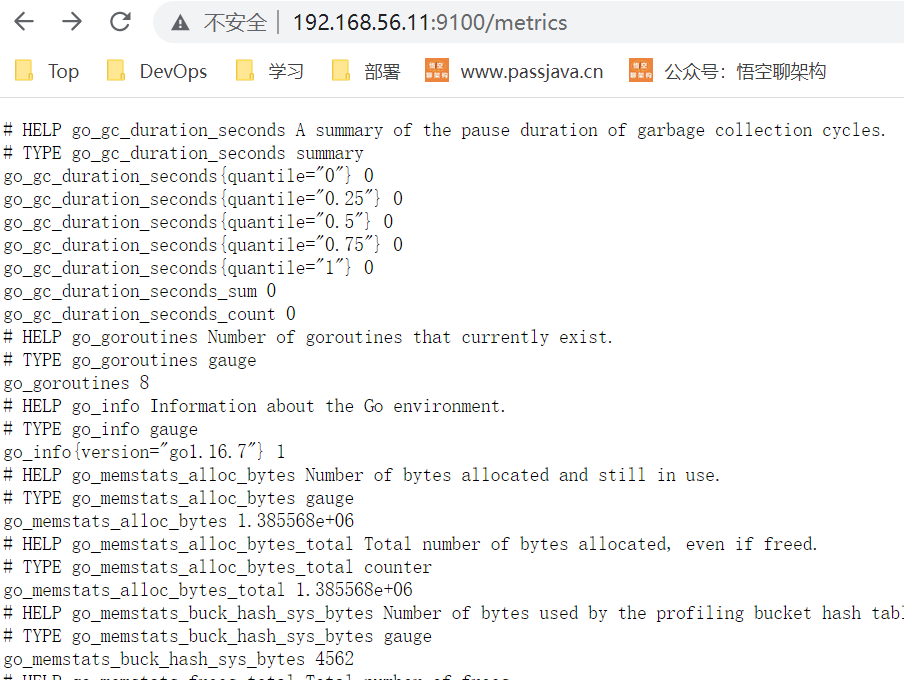
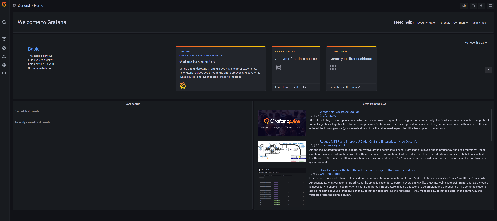
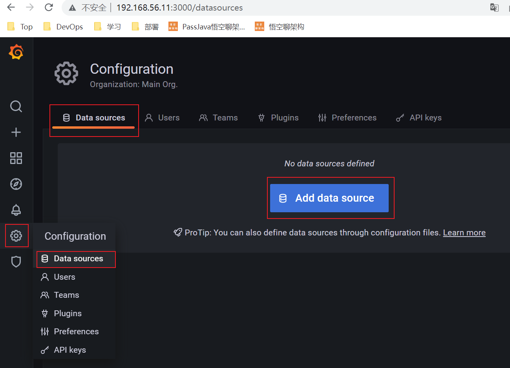
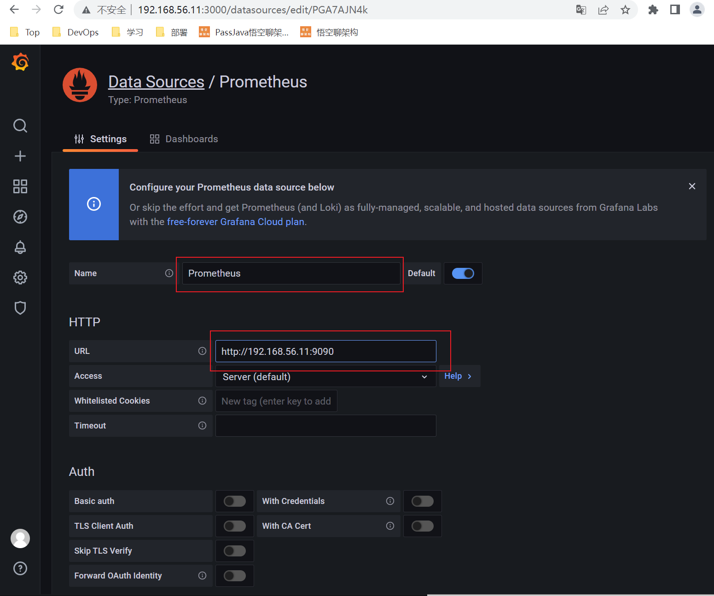
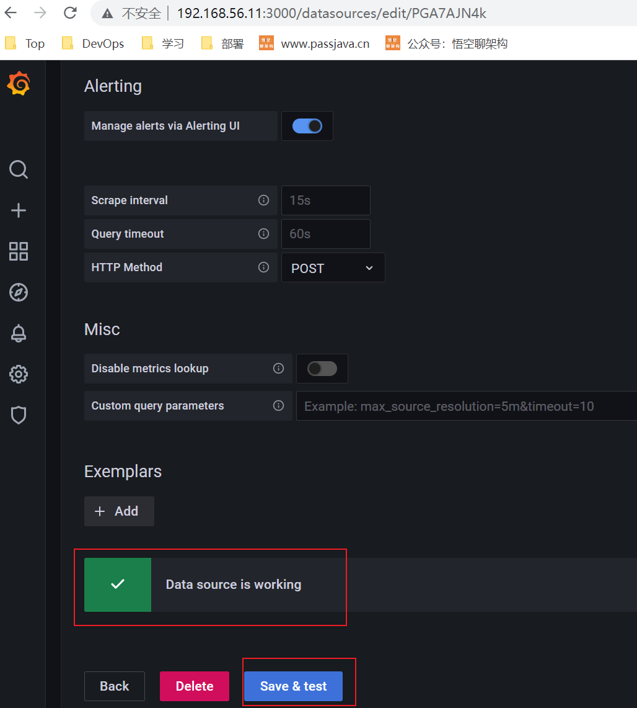
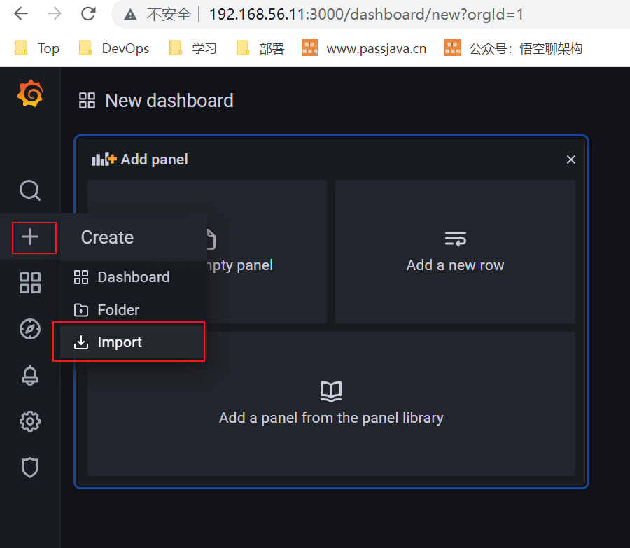
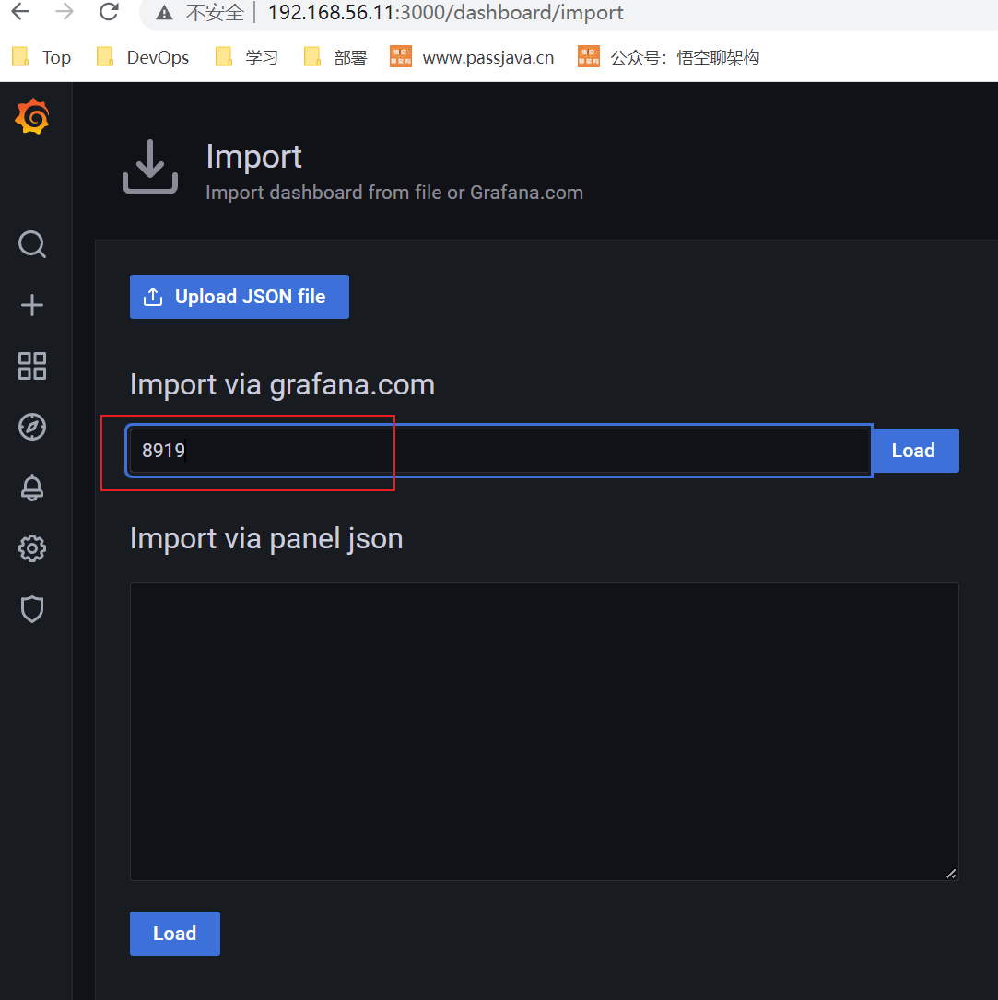
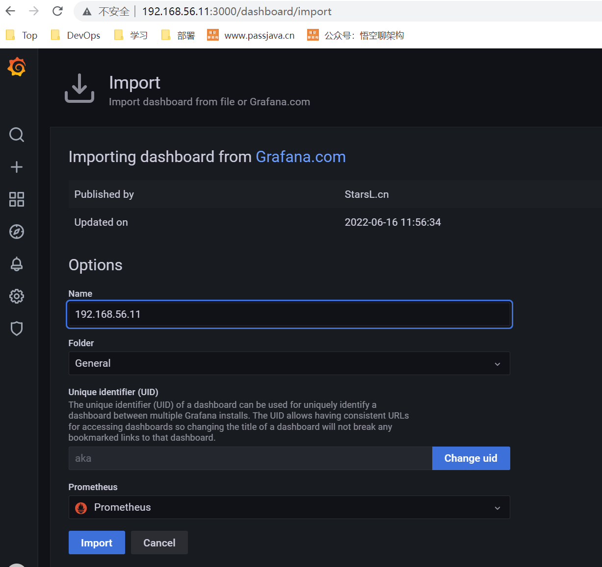
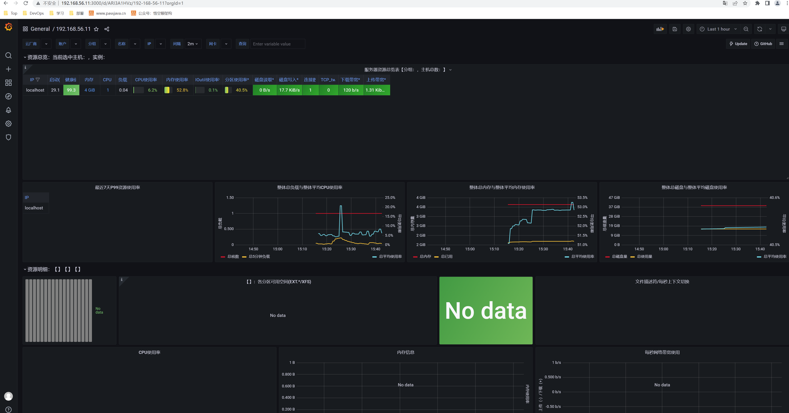

(17 条消息) 基于 docker 部署 Prometheus_北城 半夏的博客 - CSDN 博客_docker 部署 prometheus


Docker 部署 Prometheus


### 文章目录

- - - [基于 Docker 搭建 Prometheus](https://blog.csdn.net/qq_44246980/article/details/119981183#DockerPrometheus_1)
    - - [gitee](https://blog.csdn.net/qq_44246980/article/details/119981183#gitee_2)
    - [介绍 Prometheus](https://blog.csdn.net/qq_44246980/article/details/119981183#Prometheus_6)
    - - [一、安装运行 Prometheus(docker 版)](https://blog.csdn.net/qq_44246980/article/details/119981183#Prometheusdocker_28)
      - [部署 Prometheus](https://blog.csdn.net/qq_44246980/article/details/119981183#Prometheus_45)
      - - [1、安装 docker](https://blog.csdn.net/qq_44246980/article/details/119981183#1docker_46)
        - [联网状态下](https://blog.csdn.net/qq_44246980/article/details/119981183#_47)
        - [阿里云](https://blog.csdn.net/qq_44246980/article/details/119981183#_56)
        - [离线安装包下载](https://blog.csdn.net/qq_44246980/article/details/119981183#_62)
        - [2、下载镜像包](https://blog.csdn.net/qq_44246980/article/details/119981183#2_68)
        - [3、启动 node-exporter](https://blog.csdn.net/qq_44246980/article/details/119981183#3nodeexporter_111)
        - - [访问 url：](https://blog.csdn.net/qq_44246980/article/details/119981183#url_133)
        - [4、启动 mysqld-exporter](https://blog.csdn.net/qq_44246980/article/details/119981183#4mysqldexporter_141)
        - - [访问 url：](https://blog.csdn.net/qq_44246980/article/details/119981183#url_165)
        - [5、启动 cadvisor](https://blog.csdn.net/qq_44246980/article/details/119981183#5cadvisor_174)
        - - [访问 url：](https://blog.csdn.net/qq_44246980/article/details/119981183#url_202)
        - [6、启动 prometheus](https://blog.csdn.net/qq_44246980/article/details/119981183#6prometheus_212)
        - - [内容如下：](https://blog.csdn.net/qq_44246980/article/details/119981183#_222)
        - [7、启动 prometheus](https://blog.csdn.net/qq_44246980/article/details/119981183#7prometheus_262)
        - - [访问 url：](https://blog.csdn.net/qq_44246980/article/details/119981183#url_293)
        - [8、启动 grafana](https://blog.csdn.net/qq_44246980/article/details/119981183#8grafana_306)
        - - [选择 Prometheus](https://blog.csdn.net/qq_44246980/article/details/119981183#Prometheus_367)


### 基于 Docker 搭建 Prometheus


#### gitee


自动安装部署
https://gitee.com/yuanhuanliang/Prometheus
当前自动部署尚未完成，需要手动安装


### 介绍 Prometheus


Prometheus（普罗米修斯）是一套开源的监控 & 报警 & 时间序列数据库的组合，起始是由 SoundCloud 公司开发的。随着发展，越来越多公司和组织接受采用 Prometheus，社会也十分活跃，他们便将它独立成开源项目，并且有公司来运作。Google SRE 的书内也曾提到跟他们 BorgMon 监控系统相似的实现是 Prometheus。现在最常见的 Kubernetes 容器管理系统中，通常会搭配 Prometheus 进行监控。


Prometheus 基本原理是通过 HTTP 协议周期性抓取被监控组件的状态，这样做的好处是任意组件只要提供 HTTP 接口就可以接入监控系统，不需要任何 SDK 或者其他的集成过程。这样做非常适合虚拟化环境比如 VM 或者 Docker。


Prometheus 应该是为数不多的适合 Docker、Mesos、Kubernetes 环境的监控系统之一。


输出被监控组件信息的 HTTP 接口被叫做 exporter 。目前互联网公司常用的组件大部分都有 exporter 可以直接使用，比如 Varnish、Haproxy、Nginx、MySQL、Linux 系统信息 (包括磁盘、内存、CPU、网络等等)，具体支持的源看：https://github.com/prometheus。


与其他监控系统相比，Prometheus 的主要特点是：


一个多维数据模型（时间序列由指标名称定义和设置键 / 值尺寸）。
非常高效的存储，平均一个采样数据占~ 3.5bytes 左右，320 万的时间序列，每 30 秒采样，保持 60 天，消耗磁盘大概 228G。


一种灵活的查询语言。
不依赖分布式存储，单个服务器节点。
时间集合通过 HTTP 上的 PULL 模型进行。
通过中间网关支持推送时间。
通过服务发现或静态配置发现目标。
多种模式的图形和仪表板支持。


#### 一、安装运行 Prometheus(docker 版)


下面介绍如何使用 Prometheus、Grafana、CAdvisor、node-exporter、mysqld-exporter 对本机服务器性能、Docker 容器、MySQL 数据库进行监控。


监控本机，只需要一个 exporter


node_exporter – 用于机器系统数据收集


mysqld-exporter 用于 MySQL 数据库数据收集


Cadvisor 用于收集宿主机上的 docker 容器数据


Grafana 是一个开源的功能丰富的数据可视化平台，通常用于时序数据的可视化。它内置了以下数据源的支持：


下面是我们安装时用到的架构图：


注意：本文使用的是 CentOS 7 x64，只需要一台服务器即可！


#### 部署 Prometheus


##### 1、安装 docker


##### 联网状态下


[官网](https://docs.docker.com/install/linux/docker-ce/centos/)


```
#yum install -y yum-utils
#yum-config-manager \
    --add-repo \
    https://download.docker.com/linux/centos/docker-ce.repo
#yum -y install docker-ce 
```


##### 阿里云


```
wget http://mirrors.aliyun.com/docker-ce/linux/centos/docker-ce.repo -P /etc/yum.repos.d
yum clean all
yum makecache
```


##### 离线安装包下载


```
mkdir -p /root/docker
yum install --downloadonly --downloaddir=/root/docker docker-ce-19.03.9-3.el7 #只下载文件不安装
```


##### 2、下载镜像包


```
docker pull prom/node-exporter
docker pull prom/mysqld-exporter
docker pull google/cadvisor
docker pull prom/prometheus
docker pull grafana/grafana
```


为离线环境及网络延迟较高的用户使用


```
链接：https://pan.baidu.com/s/1gO-FjlsuIOmXuQKXvPE5Gw 提取码：uzww`
`离线安装包的docker版本为19.03，对应的镜像为当前hub.docker.com的最新版本
```


- 使用离线安装包的安装步骤
- 安装 docker
  - 解压：docker-ce.tar.gz
    - 安装：cd docker ;yum -y install ./*.rpm
    - 启动：systemctl enable --now docker
    - 如若需要，可根据实际情况，添加镜像仓库、镜像加速器
    - ` 配置镜像加速器


```
针对Docker客户端版本大于 1.10.0 的用户
您可以通过修改daemon配置文件/etc/docker/daemon.json来使用加速器
mkdir -p /etc/docker
tee /etc/docker/daemon.json <<-'EOF'
{
  "registry-mirrors": ["https://geuj9lut.mirror.aliyuncs.com"]
}
EOF
sudo systemctl daemon-reload
sudo systemctl restart docker
```


- 解压：tar -xvf images_prometheus.tar.gz
- 导入：下载好的镜像


```
   cd images_prometheus
   for i in `ls` 
    do 
        docker load -i $i
   done
```


##### 3、启动 node-exporter


```
docker run -d --name node-exporter --restart=always -p 9200:9200 -v "/proc:/host/proc:ro" -v "/sys:/host/sys:ro" -v "/:/rootfs:ro" prom/node-exporter
```


等待几秒钟，查看端口是否起来了


```
[root@docker01 ~]# netstat -anpt
Active Internet connections (servers and established)
Proto Recv-Q Send-Q Local Address           Foreign Address         State       PID/Program name    
tcp        0      0 0.0.0.0:9100            0.0.0.0:*               LISTEN      11549/docker-proxy  
tcp        0      0 0.0.0.0:22              0.0.0.0:*               LISTEN      922/sshd            
tcp        0      0 127.0.0.1:25            0.0.0.0:*               LISTEN      1351/master         
tcp        0      0 192.168.1.31:22         192.168.1.1:50920       ESTABLISHED 11087/sshd: root@no 
tcp        0     36 192.168.1.31:22         192.168.1.1:50919       ESTABLISHED 11080/sshd: root@pt 
tcp        0      0 192.168.1.31:22         192.168.1.1:63031       ESTABLISHED 10454/sshd: root@pt 
tcp        0      0 192.168.1.31:22         192.168.1.1:63032       ESTABLISHED 10463/sshd: root@no 
tcp6       0      0 :::9100                 :::*                    LISTEN      11553/docker-proxy  
tcp6       0      0 :::22                   :::*                    LISTEN      922/sshd            
tcp6       0      0 ::1:25                  :::*                    LISTEN      1351/master         
```


###### 访问 url：


http://192.168.56.11:9100/metrics


效果如下：


这些都是收集到数据，有了它就可以做宿主机 Linux 数据展示了


##### 4、启动 mysqld-exporter


```sh
docker run -d --name mysqld_exporter --restart=always -p 9104:9104 -e DATA_SOURCE_NAME="root:123456@(192.168.56.11:3306)/" prom/mysqld-exporter

```


**等待几秒钟，查看端口是否起来了**


```
[root@docker01 ~]# netstat -anpt
Active Internet connections (servers and established)
Proto Recv-Q Send-Q Local Address           Foreign Address         State       PID/Program name    
tcp        0      0 0.0.0.0:9100            0.0.0.0:*               LISTEN      11549/docker-proxy  
tcp        0      0 0.0.0.0:9104            0.0.0.0:*               LISTEN      11636/docker-proxy  
tcp        0      0 0.0.0.0:22              0.0.0.0:*               LISTEN      922/sshd            
tcp        0      0 127.0.0.1:25            0.0.0.0:*               LISTEN      1351/master         
tcp        0      0 192.168.1.31:22         192.168.1.1:50920       ESTABLISHED 11087/sshd: root@no 
tcp        0      0 192.168.1.31:22         192.168.1.1:50919       ESTABLISHED 11080/sshd: root@pt 
tcp        0      0 192.168.1.31:22         192.168.1.1:63031       ESTABLISHED 10454/sshd: root@pt 
tcp        0      0 192.168.1.31:22         192.168.1.1:63032       ESTABLISHED 10463/sshd: root@no 
tcp6       0      0 :::9100                 :::*                    LISTEN      11553/docker-proxy  
tcp6       0      0 :::9104                 :::*                    LISTEN      11640/docker-proxy  
tcp6       0      0 :::22                   :::*                    LISTEN      922/sshd            
tcp6       0      0 ::1:25                  :::*                    LISTEN      1351/master         
```


###### 访问 url：


http://192.168.56.11:9104/metrics


**效果如下：**




这些都是收集到数据，有了它就可以做 MySQL 数据库数据展示了


##### 5、启动 cadvisor


```
docker run -v /:/rootfs:ro -v /var/run:/var/run:rw -v /sys:/sys:ro -v /var/lib/docker/:/var/lib/docker:ro -v /dev/disk/:/dev/disk:ro -p 8080:8080 -d --name=cadvisor --restart=always google/cadvisor:latest
```


**等待几秒钟，查看端口是否起来了**


```
[root@docker01 ~]# netstat -anpt
Active Internet connections (servers and established)
Proto Recv-Q Send-Q Local Address           Foreign Address         State       PID/Program name    
tcp        0      0 0.0.0.0:9100            0.0.0.0:*               LISTEN      11549/docker-proxy  
tcp        0      0 0.0.0.0:8080            0.0.0.0:*               LISTEN      11746/docker-proxy  
tcp        0      0 0.0.0.0:9104            0.0.0.0:*               LISTEN      11636/docker-proxy  
tcp        0      0 0.0.0.0:22              0.0.0.0:*               LISTEN      922/sshd            
tcp        0      0 127.0.0.1:25            0.0.0.0:*               LISTEN      1351/master         
tcp        0      0 192.168.1.31:22         192.168.1.1:50920       ESTABLISHED 11087/sshd: root@no 
tcp        0      0 192.168.1.31:22         192.168.1.1:50919       ESTABLISHED 11080/sshd: root@pt 
tcp        0      0 192.168.1.31:22         192.168.1.1:63031       ESTABLISHED 10454/sshd: root@pt 
tcp        0      0 192.168.1.31:22         192.168.1.1:63032       ESTABLISHED 10463/sshd: root@no 
tcp6       0      0 :::9100                 :::*                    LISTEN      11553/docker-proxy  
tcp6       0      0 :::8080                 :::*                    LISTEN      11750/docker-proxy  
tcp6       0      0 :::9104                 :::*                    LISTEN      11640/docker-proxy  
tcp6       0      0 :::22                   :::*                    LISTEN      922/sshd            
tcp6       0      0 ::1:25                  :::*                    LISTEN      1351/master
```


###### 访问 url：


http://192.168.56.11:8080/metrics


**效果如下：**


这些都是收集到数据，有了它就可以做 Docker 容器数据展示了


##### 6、配置 prometheus


新建目录 prometheus，编辑配置文件 prometheus.yml

```
mkdir /opt/prometheus
cd /opt/prometheus/
vim prometheus.yml
```

###### 内容如下：

```
global:
  scrape_interval:     60s
  evaluation_interval: 60s

scrape_configs:

  - job_name: prometheus
    static_configs:
      - targets: ['localhost:9090']
        labels:
          instance: prometheus

  - job_name: node-exporter
    static_configs:
      - targets: ['192.168.56.11:9100']
        labels:
          instance: localhost
   #  - targets: ['192.168.1.22:9100']  
   #这里添加targets，可以使用Prometheus监控其他装有node_exporter的节点，单节点则不需要
   #    labels:
   #      instance: 192.168.1.22

  - job_name: cadvisor
    static_configs:
      - targets: ['192.168.56.11:8080']
        labels:
          instance: cAdvisor

  - job_name: mysqld
    static_configs:
      - targets: ['192.168.56.11:9104']
        labels:
          instance: mysql-exporter
```

##### 7、启动 prometheus


```sh
docker run  -d --name prometheus --restart=always -p 9090:9090 -v /opt/prometheus/prometheus.yml:/etc/prometheus/prometheus.yml prom/prometheus
```


注意：宿主机的路径必须是绝对路径：/opt/prometheus/prometheus.yml，否者报错


等待几秒钟，查看端口状态


```
[root@docker01 prometheus]# netstat -anpt
Active Internet connections (servers and established)
Proto Recv-Q Send-Q Local Address           Foreign Address         State       PID/Program name    
tcp        0      0 0.0.0.0:9090            0.0.0.0:*               LISTEN      12175/docker-proxy  
tcp        0      0 0.0.0.0:9100            0.0.0.0:*               LISTEN      11549/docker-proxy  
tcp        0      0 0.0.0.0:8080            0.0.0.0:*               LISTEN      11746/docker-proxy  
tcp        0      0 0.0.0.0:9104            0.0.0.0:*               LISTEN      11636/docker-proxy  
tcp        0      0 0.0.0.0:22              0.0.0.0:*               LISTEN      922/sshd            
tcp        0      0 127.0.0.1:25            0.0.0.0:*               LISTEN      1351/master         
tcp        0      0 192.168.1.31:22         192.168.1.1:50920       ESTABLISHED 11087/sshd: root@no 
tcp        0     36 192.168.1.31:22         192.168.1.1:50919       ESTABLISHED 11080/sshd: root@pt 
tcp        0      0 192.168.1.31:22         192.168.1.1:63031       ESTABLISHED 10454/sshd: root@pt 
tcp        0      0 192.168.1.31:22         192.168.1.1:63032       ESTABLISHED 10463/sshd: root@no 
tcp6       0      0 :::9090                 :::*                    LISTEN      12179/docker-proxy  
tcp6       0      0 :::9100                 :::*                    LISTEN      11553/docker-proxy  
tcp6       0      0 :::8080                 :::*                    LISTEN      11750/docker-proxy  
tcp6       0      0 :::9104                 :::*                    LISTEN      11640/docker-proxy  
tcp6       0      0 :::22                   :::*                    LISTEN      922/sshd            
tcp6       0      0 ::1:25                  :::*                    LISTEN      1351/master  
```


###### 访问 url：


http://192.168.56.11:9090/graph


效果如下：


访问 targets，url 如下：
http://192.168.56.11:9090/targets
效果如下：


如果状态没有 UP 起来，**等待一会**，就会 UP 了


##### 8、启动 grafana


新建空文件夹 grafana-storage，用来存储数据


``` SH
mkdir /opt/grafana-storage
```


添加权限


``` SH
chmod 777 -R /opt/grafana-storage
```


因为 grafana 用户会在这个目录写入文件，直接设置 777，比较简单粗暴！


启动 grafana


``` sh
docker run -d --name grafana --restart=always -p 3000:3000 --name=grafana -v /opt/grafana-storage:/var/lib/grafana grafana/grafana
```


等待几秒钟，查看端口状态


```
[root@docker01 grafana-storage]# netstat -anpt
Active Internet connections (servers and established)
Proto Recv-Q Send-Q Local Address           Foreign Address         State       PID/Program name    
tcp        0      0 0.0.0.0:9090            0.0.0.0:*               LISTEN      12175/docker-proxy  
tcp        0      0 0.0.0.0:9100            0.0.0.0:*               LISTEN      11549/docker-proxy  
tcp        0      0 0.0.0.0:8080            0.0.0.0:*               LISTEN      11746/docker-proxy  
tcp        0      0 0.0.0.0:9104            0.0.0.0:*               LISTEN      11636/docker-proxy  
tcp        0      0 0.0.0.0:22              0.0.0.0:*               LISTEN      922/sshd            
tcp        0      0 0.0.0.0:3000            0.0.0.0:*               LISTEN      12428/docker-proxy  
tcp        0      0 127.0.0.1:25            0.0.0.0:*               LISTEN      1351/master         
tcp        0      0 192.168.1.31:22         192.168.1.1:50920       ESTABLISHED 11087/sshd: root@no 
tcp        0      0 192.168.1.31:22         192.168.1.1:50919       ESTABLISHED 11080/sshd: root@pt 
tcp        0      0 192.168.1.31:22         192.168.1.1:63031       ESTABLISHED 10454/sshd: root@pt 
tcp        0      0 192.168.1.31:22         192.168.1.1:63032       ESTABLISHED 10463/sshd: root@no 
tcp6       0      0 :::9090                 :::*                    LISTEN      12179/docker-proxy  
tcp6       0      0 :::9100                 :::*                    LISTEN      11553/docker-proxy  
tcp6       0      0 :::8080                 :::*                    LISTEN      11750/docker-proxy  
tcp6       0      0 :::9104                 :::*                    LISTEN      11640/docker-proxy  
tcp6       0      0 :::22                   :::*                    LISTEN      922/sshd            
tcp6       0      0 :::3000                 :::*                    LISTEN      12432/docker-proxy  
tcp6       0      0 ::1:25                  :::*                    LISTEN      1351/master         
```


访问 url：


http://192.168.56.11:3000/


```
默认会先跳转到登录页面，默认的用户名和密码都是admin
```


```
登录之后，它会要求你重置密码。你还可以再输次admin密码！
```


密码设置完成之后，就会跳转到首页




点击 Setting——Add data source，由于使用的是镜像方式，所以版本比较新。和网络上的文章展示的图片不一样





###### 选择 Prometheus


name 名字写 Prometheus


type 选择 Prometheus，因为数据都从它那里获取


url 输入 Prometheus 的 ip(docker 容器私网 ip)+ 端口





点击下面的 Save & Test，如果出现绿色的，说明 ok 了





## 导入模板

回到首页，导入 grafana 监控模板，mysql 监控模板 id 为 7362，填入如下输入框内










保存就可以进行数据可视化展示




导入主机的监控模板，模板 id 为 8919，以相同方式导入即可


导入容器的监控模板，模板 id 为 179，以相同方式导入即可

更多监控模板：https://grafana.com/grafana/dashboards


最后
来一张最终效果：


全文完

本文由 [简悦 SimpRead](http://ksria.com/simpread) 优化，用以提升阅读体验

使用了 全新的简悦词法分析引擎 beta，[点击查看](http://ksria.com/simpread/docs/#/词法分析引擎)详细说明


[文章目录](https://blog.csdn.net/qq_44246980/article/details/119981183#sr-toc-0)[基于 Docker 搭建 Prometheus](https://blog.csdn.net/qq_44246980/article/details/119981183#sr-toc-1)[gitee](https://blog.csdn.net/qq_44246980/article/details/119981183#sr-toc-2)[介绍 Prometheus](https://blog.csdn.net/qq_44246980/article/details/119981183#sr-toc-3)[一、安装运行 Prometheus(docker 版)](https://blog.csdn.net/qq_44246980/article/details/119981183#sr-toc-4)[部署 Prometheus](https://blog.csdn.net/qq_44246980/article/details/119981183#sr-toc-5)