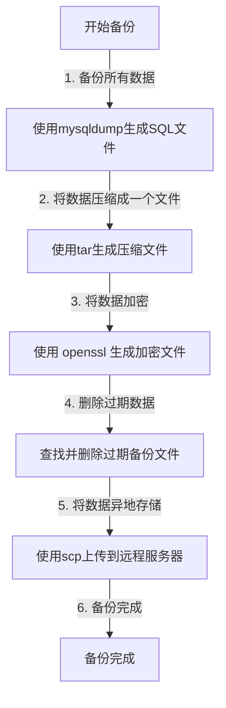
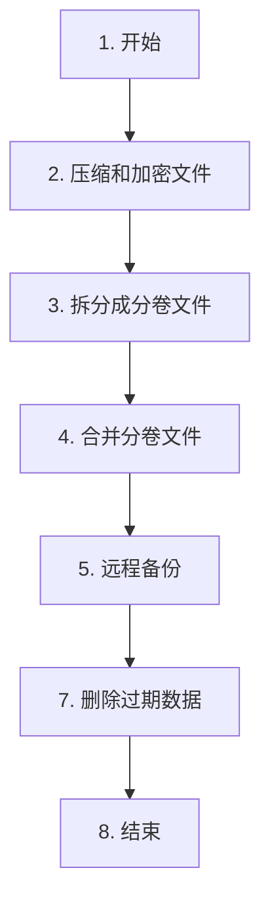

# 避免删库跑路的最好办法

你好，我是悟空。

[toc]


## 一、前言

### 1.1 删库跑路是什么？

`删库跑路`：是一个在开发和运维领域常见的幽默说法，但它指的是一种严重的故障情境：意外删除了生产数据库中的数据。

在实际操作中，这种情况可能会导致严重的数据丢失和业务中断。

### 1.2 避免删除跑路的方式

**权限控制：** 限制对生产环境的直接访问和操作，确保只有受信任的人员才能执行敏感操作。

**日志审计：** 记录所有操作，包括谁、什么时间、做了什么操作，以便追踪和审计。

**备份策略：** 实施完善的备份策略，定期备份数据，并将备份数据存储在安全的地方，以便在出现问题时能够快速恢复数据。

**多地备份：** 将备份数据存储在不同的地理位置，以防止因某一地点发生灾难而导致数据丢失。

**权限分离：** 采用最小权限原则，给予员工仅限于其工作职责所需的最低权限，避免滥用权限。

**监控预警：** 部署监控系统，监视系统状态和用户行为，及时发现异常操作并采取措施。

**培训意识：** 对员工进行安全意识培训，让他们了解删除跑路的危害，以及如何正确处理数据和执行操作。

而最最最重要的一种方式就是备份！

**重要的事情说三遍：备份！备份！备份！**

为什么说备份是最重要的，因为只要有备份文件，数据就能恢复。但前提是备份文件别被删了！

那么今天我们就来看下如何备份数据库以及重要的文件。

## 二、环境说明

本篇涉及到的服务器环境如下表所示：

| 序号 | 说明                              | 说明                     |
| ---- | --------------------------------- | ------------------------ |
| 1    | Ubuntu 系统                       | 服务器操作系统           |
| 2    | Docker 容器                       | 容器                     |
| 3    | MySQL 数据库                      | 备份数据库，以容器化部署 |
| 4    | FastDFS 文件存储或 Redis 数据文件 | 备份磁盘文件             |
| 5    | expect 工具                       | 自动化交互式任务的工具   |

Ubuntu 上安装有 Docker，MySQL 以容器化的形式部署，FastDFS

## 三、备份方案

### 3.1 备份 MySQL 数据库的所有数据

- 使用 `mysqldump` 命令备份所有数据，并生成一个 SQL 文件。
- 使用 `tar` 命令将 SQL 文件压缩成一个文件。
- 使用 openssl 加密压缩文件。
- 删除过期数据
- 使用 `scp` 或 `rsync` 命令将加密文件上传到远程服务器进行异地存储。



### 3.2 备份数据文件

-  压缩和加密文件
- 拆分成分卷文件
- 合并分卷文件
- 远程备份
- 删除过期数据




## 四、自动化定期备份

指定一个 cron 作业，在每天凌晨 2 点 10 分运行一个脚本，并将输出追加到 `/home/passjava/backup/cron_log.txt` 文件中。

编辑定时任务

``` SH
crontab -uroot -e
```

编写定时任务

``` 
10 2 * * * bash /home/passjava/backup/你的脚本 >> /home/passjava/backup/cron_log.txt
```

## 五、备份脚本

### 5.1 数据库备份脚本

``` SH
#!/bin/bash
# 设置mysql的登录用户名和密码(根据实际情况填写)
mysql_user="root"
mysql_password="xxx"
mysql_host="数据库服务器 ip"
mysql_port="3306"
#mysql_charset="utf8mb4"
 
# 备份文件存放地址(根据实际情况填写)
backup_location=/home/passjava/backup/mysql/passjava_web
 
# 是否删除过期数据
expire_backup_delete="ON"
expire_days=7
backup_time=`date +%Y-%m-%d-%H-%M-%S`

#根据docker ps获取mysql容器的ID
mysqlContainerName=`sudo docker ps -q --filter="name=mysql"`
#在运行在docker环境的mysql中执行备份命令
sudo docker exec $mysqlContainerName mysqldump passjava_web -u$mysql_user -p$mysql_password > $backup_location/$backup_time-backup-mysql-passjava_web.sql

tar -czvf - $backup_location/$backup_time-backup-mysql-passjava_web.sql | openssl des3 -salt -k passjava123456 -out $backup_location/$backup_time-backup-mysql-passjava_web.sql.tar.gz

# 删除过期数据
if [ "$expire_backup_delete" == "ON" -a  "$backup_location" != "" ];then
        `find $backup_location/ -type f -mtime +$expire_days | xargs rm -rf`
        echo "Expired backup data delete complete!"
fi

echo "开始远程备份 passjava_web"

expect -c "
    spawn scp -r /home/passjava/backup/mysql/passjava_web/$backup_time-backup-mysql-passjava_web.sql.tar.gz passjava@异地服务器1:/home/passjava/backup/mysql/passjava_web
    expect {
        \"*assword\" {set timeout 300; send \"passjava\r\"; exp_continue;}
        \"yes/no\" {send \"yes\r\";}
    }
	spawn scp -r /home/passjava/backup/mysql/passjava_web/$backup_time-backup-mysql-passjava_web.sql.tar.gz passjava@异地服务器2:/home/passjava/backup/mysql/passjava_web
    expect {
        \"*assword\" {set timeout 300; send \"passjava\r\"; exp_continue;}
        \"yes/no\" {send \"yes\r\";}
    }
expect eof"

echo "完成远程备份 passjava_web"

rm -f $backup_location/$backup_time-backup-mysql-passjava_web.sql

```

### 5.2 文件备份脚本

本脚本用于备份 FastDFS 分布式文件系统的文件，也可以改为备份 redis 的数据文件。

``` SH
#!/bin/bash
 
# 备份文件存放地址(根据实际情况填写)
backup_location=/home/passjava/backup/fdfs/data
 
# 是否删除过期数据
expire_backup_delete="ON"
expire_days=7
backup_time=`date +%Y-%m-%d-%H-%M-%S`

# 压缩加密数据库备份文件
tar -czvf - /home/passjava/fdfs | openssl des3 -salt -k passjava123456 | split -b 200m -d - $backup_location/$backup_time-fdfs-data.tar.gz

# 删除过期数据
if [ "$expire_backup_delete" == "ON" -a  "$backup_location" != "" ];then
        `find $backup_location/ -type f -mtime +$expire_days | xargs rm -rf`
        echo "Expired backup data delete complete!"
fi

cat $backup_location/$backup_time-fdfs-data.tar.gz* > $backup_location/$backup_time-fdfs-data-all.tar.gz

echo "开始远程备份 fdfs"

expect -c "
    spawn scp -r $backup_location/$backup_time-fdfs-data-all.tar.gz passjava@192.168.1.100:/home/passjava/backup/fdfs/data
    expect {
        \"*assword\" {set timeout 300; send \"passjava\r\"; exp_continue;}
        \"yes/no\" {send \"yes\r\";}
    }
expect eof"

echo "完成远程备份 fdfs"

rm -f $backup_location/$backup_time-fdfs-data.tar.gz*

```

## 六、总结

删库跑路是指某人恶意删除重要数据后逃避责任的行为，可能导致严重的经济损失和安全风险。

为了避免此类情况，需要实施权限管理、定期备份数据，并建立自动化的备份脚本，以确保数据安全和系统稳定运行。