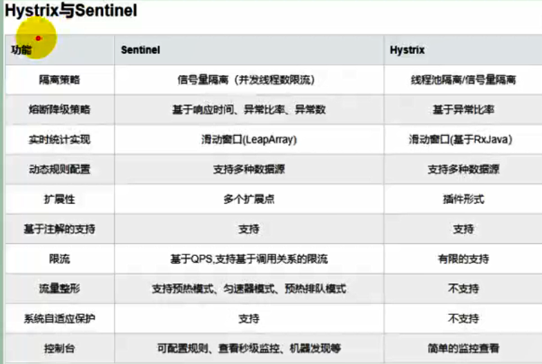

# Spring Cloud 整合 Alibaba-Sentinel

## 一、简介

### 1.1 熔断降级限流

- 什么是熔断？

关键字：`断路保护`。比如 A 服务调用 B 服务，由于网络问题或 B 服务宕机了或 B 服务的处理时间长，导致请求的时间超长，如果在一定时间内多次出现这种情况，就可以直接将 B 断路了（A 不再请求B）。而调用 B 服务的请求直接返回降级数据，不必等待 B 服务的执行。因此 B 服务的问题，不会级联影响到 A 服务。

- 什么是降级？

关键字：`返回降级数据`。网站处于流量高峰期，服务器压力剧增，根据当前业务情况及流量，对一些服务和页面进行有策略的降级（停止服务，所有的调用直接返回降级数据）。以此缓解服务器资源的压力，保证核心业务的正常运行，保持了客户和大部分客户得到正确的响应。降级数据可以简单理解为快速返回了一个 false，前端页面告诉用户“服务器当前正忙，请稍后再试。”

- 什么是限流？

  对请求的流量进行控制， 只放行部分请求，使服务能够承担不超过自己能力的流量压力。

- 熔断和降级的相同点？
  - 熔断和限流都是为了保证集群大部分服务的可用性和可靠性。防止核心服务崩溃。
  - 给终端用户的感受就是某个功能不可用
- 熔断和降级的不同点？
  - 熔断是被调用放出现了故障，主动触发的操作。
  - 降级是基于全局考虑，停止某些正常服务，释放资源。

