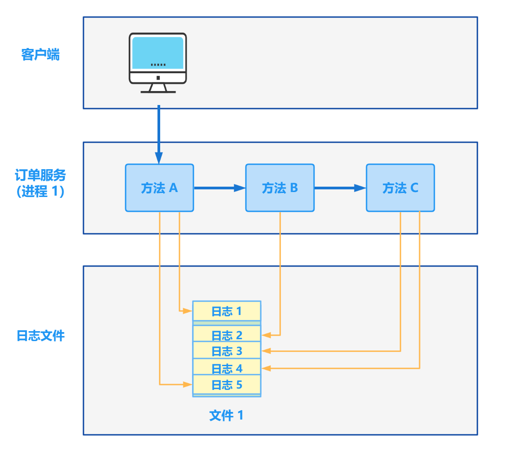
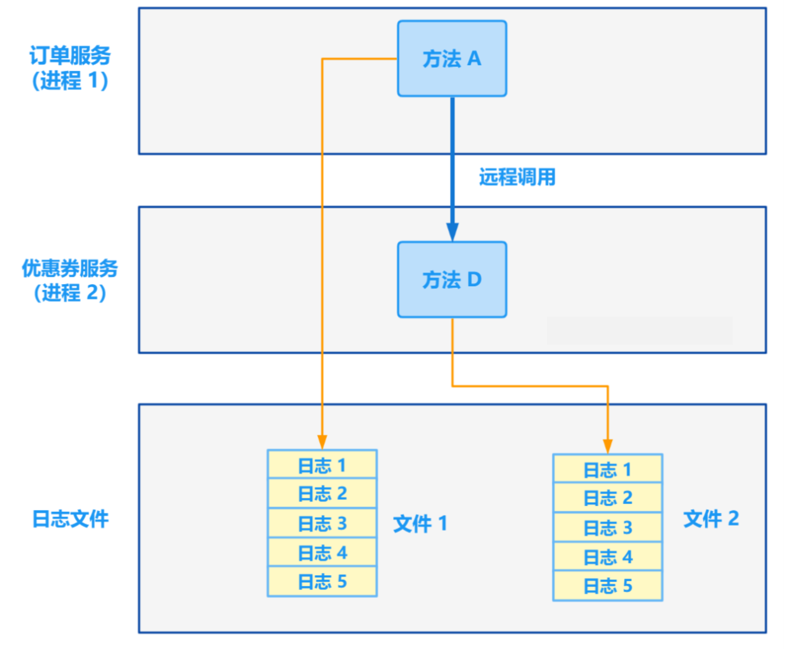
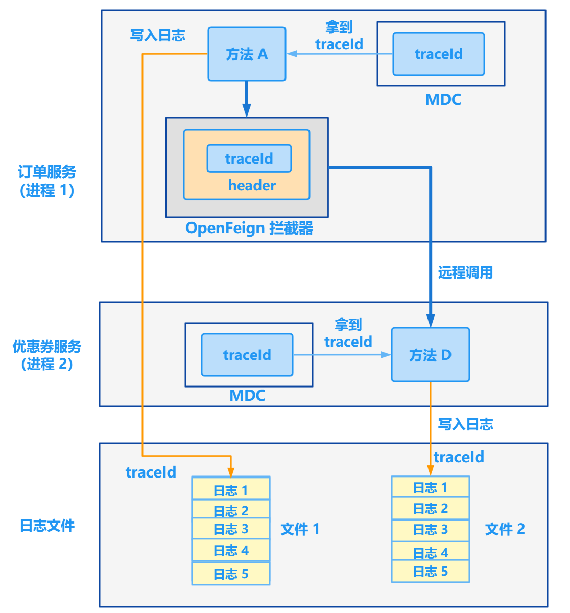
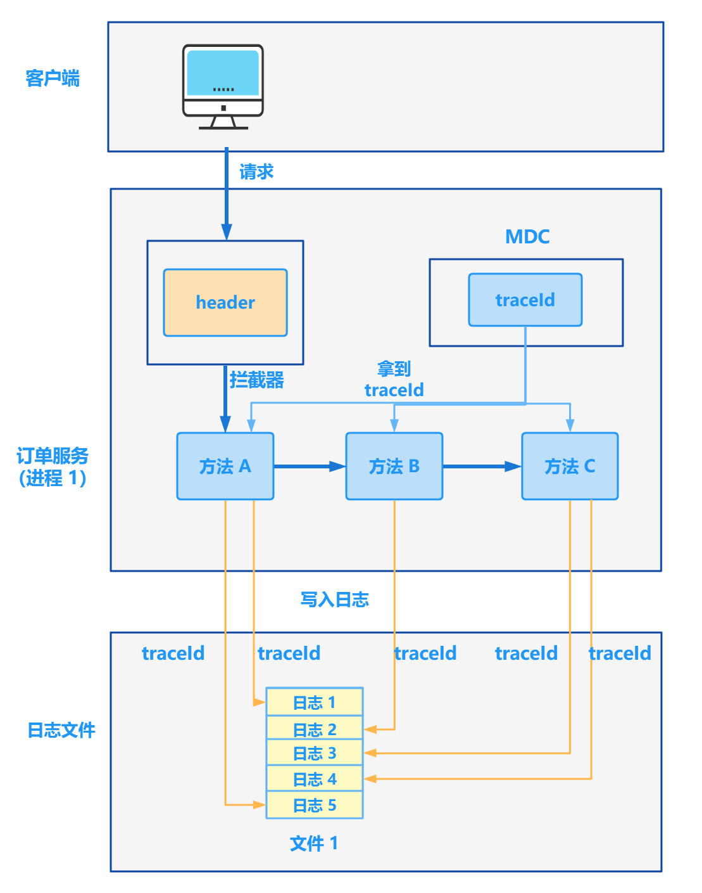

# 功能重构：增加日志级别的链路追踪

## **一、痛点**

### 痛点一：进程内的多条日志无法追踪

> 一个请求调用，假设会调用后端十几个方法，打印十几次日志，无法将这些日志串联起来。

如下图所示：客户端调用订单服务，订单服务中方法 A 调用方法 B，方法 B 调用方法 C。

方法 A 打印第一条日志和第五条日志，方法 B 打印第二条日志，方法 C 打印第三条日志和第四条日志，但是这 5 条日志并没有任何联系，唯一的联系就是时间是按照时间循序打印的，但是如果有其他并发的请求调用，则会干扰日志的连续性。



### 痛点二：跨服务的日志如何进行关联

> 每个微服务都会记录自己这个进程的日志，跨进程的日志如何进行关联？

如下图所示：订单服务和优惠券服务属于两个微服务，部署在两台机器上，订单服务的 A 方法远程调用优惠券服务的 D 方法。

方法 A 将日志打印到日志文件 1 中，记录了 5 条日志，方法 D 将日志打印到日志文件 2 中，记录了 5 条日志。但是这 10 条日志是无法关联起来的。



### 痛点三：跨线程的日志如何关联

> 主线程和子线程的日志如何关联？

如下图所示：主线程的方法 A 启动了一个子线程，子线程执行方法 E。

方法 A 打印了第一条日志，子线程 E 打印了第二条日志和第三条日志。


### 痛点四：第三方调用我们的服务，如何追踪？

本篇要解决的核心问题是第一个和第二个问题，多线程目前还未引入，目前也没有第三方来调用，后期再来优化第三个和第四个问题。

## **二、方案**

### 1.1 解决方案

① 使用 Skywalking traceId 进行链路追踪

② 使用 Elastic APM 的 traceId 进行链路追踪

③ MDC 方案：自己生成 traceId 并 put 到 MDC 里面。

项目初期，先不引入过多的中间件，用简单可行的方案先尝试，所以这里用第三种方案 MDC。

### 1.2 MDC 方案

MDC（Mapped Diagnostic Context）用于存储运行上下文的特定线程的上下文数据。因此，如果使用 log4j 进行日志记录，则每个线程都可以拥有自己的MDC，该 MDC 对整个线程是全局的。属于该线程的任何代码都可以轻松访问线程的 MDC 中存在的值。

## **三、原理和实战**

### 2.1 追踪一个请求的多条日志

我们先来看第一个痛点，如何在一个请求中，将多条日志串联起来。

该方案的原理如下图所示：



（1）在 logback 日志配置文件中的日志格式中添加 %X{traceId} 配置。

```
<pattern>%d{yyyy-MM-dd HH:mm:ss.SSS} [%thread] %X{traceId} %-5level %logger - %msg%n</pattern>
```

（2）自定一个拦截器，从请求的 `header` 中获取 `traceId` ，如果存在则放到 MDC 中，否则直接用 UUID 当做 traceId，然后放到 MDC 中。

（3）配置拦截器。

当我们打印日志的时候，会自动打印 traceId，如下所示，多条日志的 traceId 相同。


### 示例代码

拦截器代码：

```
/**
 * @author www.passjava.cn,公众号：悟空聊架构
 * @date 2022-07-05 
 */
@Service
public class LogInterceptor extends HandlerInterceptorAdapter {

    private static final String TRACE_ID = "traceId";

    @Override
    public boolean preHandle(HttpServletRequest request, HttpServletResponse response, Object handler) throws Exception {
        String traceId = request.getHeader(TRACE_ID);
        if (StringUtils.isEmpty(traceId)) {
            MDC.put("traceId", UUID.randomUUID().toString());
        } else {
            MDC.put(TRACE_ID, traceId);
        }

        return true;
    }

    @Override
    public void postHandle(HttpServletRequest request, HttpServletResponse response, Object handler, ModelAndView modelAndView) throws Exception {
        //防止内存泄露
        MDC.remove("traceId");
    }
}
```

配置拦截器：

```
/**
 * @author www.passjava.cn,公众号：悟空聊架构
 * @date 2022-07-05 
 */
@Configuration
public class InterceptorConfig implements WebMvcConfigurer {

    @Resource
    private LogInterceptor logInterceptor;

    @Override
    public void addInterceptors(InterceptorRegistry registry) {
        registry.addInterceptor(logInterceptor).addPathPatterns("/**");
    }
}
```

### 2.2 跨服务跟踪多条日志

解决方案的原理图如下所示：



订单服务远程调用优惠券服务，需要在订单服务中添加 OpenFeign 的拦截器，拦截器里面做的事就是往 请求的 header 中添加 traceId，这样调用到优惠券服务时，就能从 header 中拿到这次请求的 traceId。

代码如下所示：

```
/**
 * @author www.passjava.cn,公众号：悟空聊架构
 * @date 2022-07-05 
 */
@Configuration
public class FeignInterceptor implements RequestInterceptor {
    private static final String TRACE_ID = "traceId";

    @Override
    public void apply(RequestTemplate requestTemplate) {
        requestTemplate.header(TRACE_ID, (String) MDC.get(TRACE_ID));
    }
}
```

两个微服务打印的日志中，两条日志的 traceId 一致。


当然这些日志都会导入到 Elasticsearch 中的，然后通过 kibana 可视化界面搜索 traceId，就可以将整个调用链路串起来了！

## **四、总结**

本篇通过拦截器、MDC 功能，全链路加入了 traceId，然后将 traceId 输出到日志中，就可以通过日志来追踪调用链路。不论是进程内的方法级调用，还是跨进程间的服务调用，都可以进行追踪。

另外日志还需要通过 ELK Stack 技术将日志导入到 Elasticsearch 中，然后就可以通过检索 traceId，将整个调用链路检索出来了。


