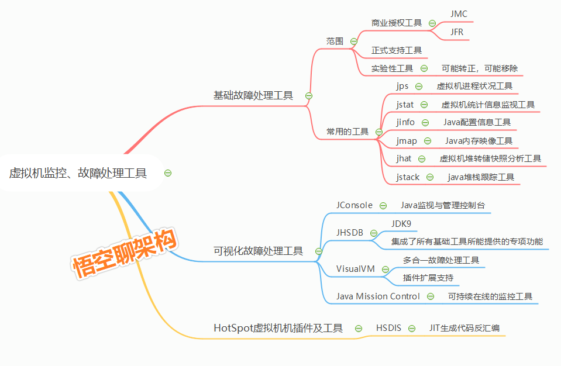
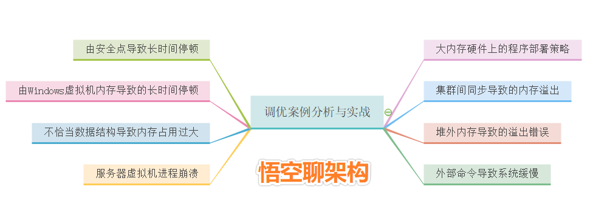
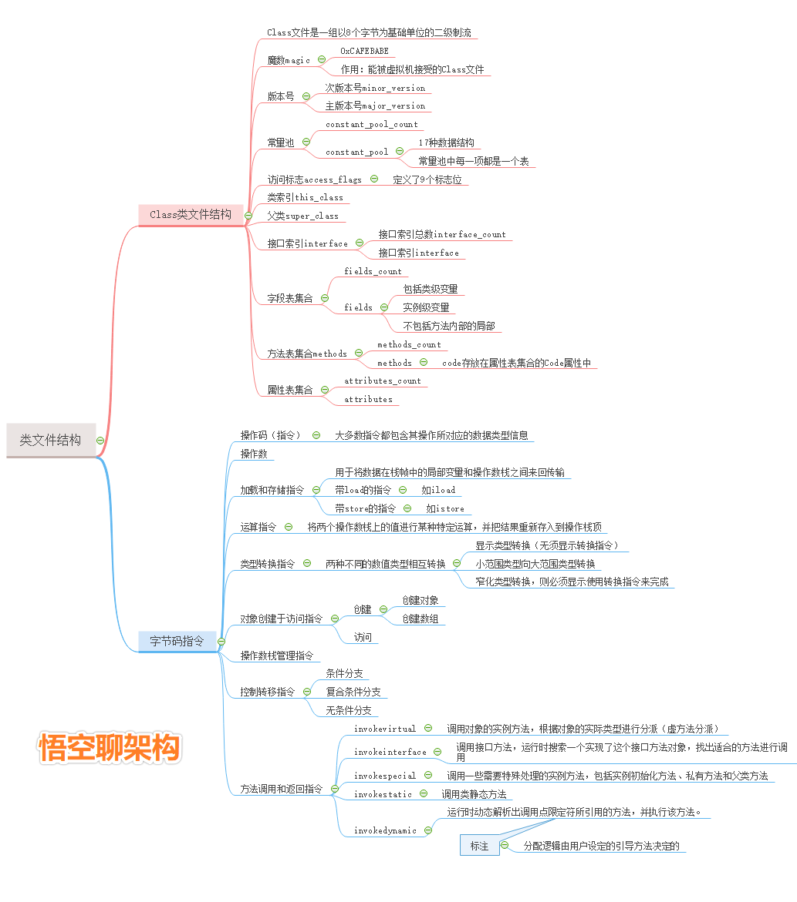
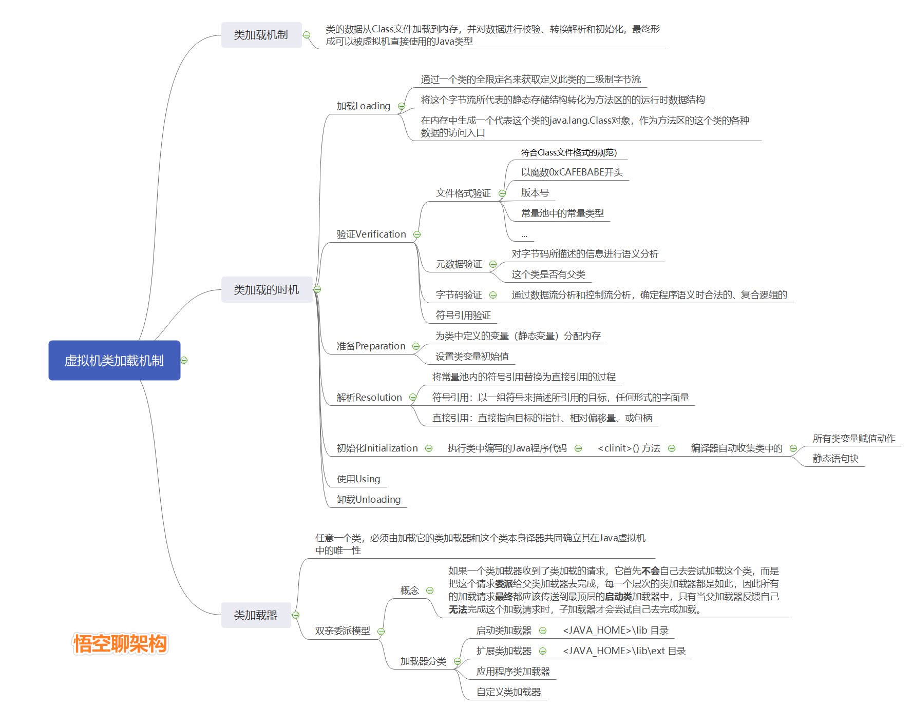
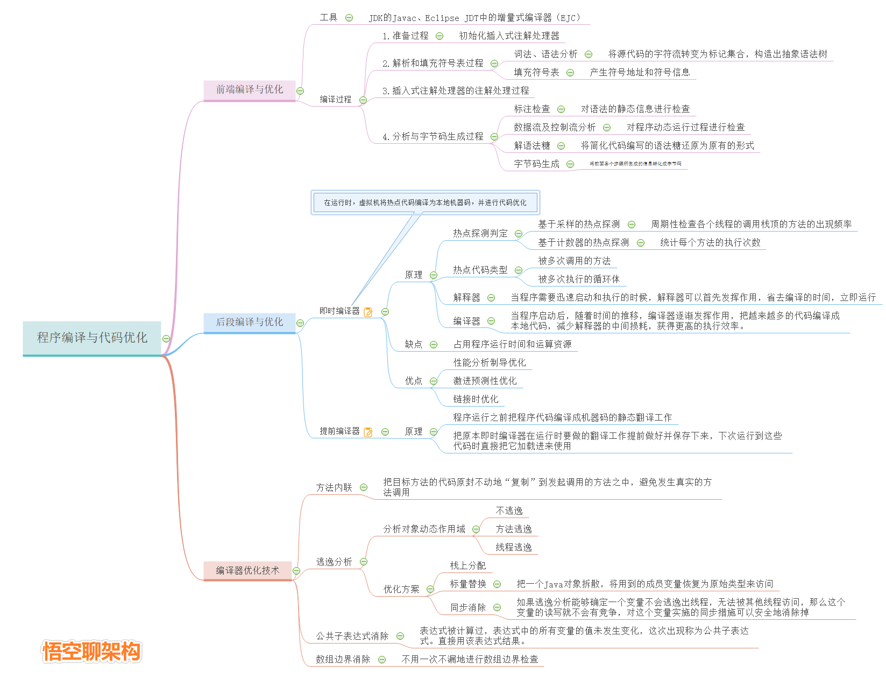

# JVM | 100道JVM面试题 + 11张思维导图就是让你懂

# 一、JVM大厂面试题

# 二、11张思维导图

## 1.Java概述 | 思维导图

## 2.JVM内存区域 | 思维导图

## 3.Java垃圾收集 | 思维导图

## 4.性能监控&故障处理| 思维导图

## 5.调优案例分析 | 思维导图

## 6.类文件结构 | 思维导图

## 7.类加载机制 | 思维导图

## 8.字节码执行引擎 | 思维导图

## 9.程序编译与代码优化 | 思维导图

## 10.Java内存模型 | 思维导图

## 11.Java线程 | 思维导图

