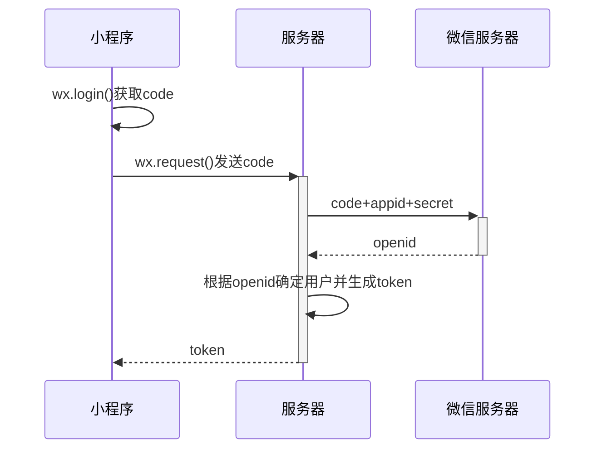

# Mac 下使用 Java JNI 调用 C 代码

参考文章：

[**Java Native Interface(JNI) 从零开始详细教程**](https://blog.csdn.net/createchance/article/details/53783490)

[**Mac 下 Java 的 native 方法以及 JNI 调用 C++ 语言**](https://blog.csdn.net/B_e_a_u_tiful1205/article/details/100594023)

[解决 fatal error: jni_md.h: No such file or directory #include “jni_md.h”](https://www.cnblogs.com/wanderHao/p/12817565.html)

[**Mac OS arm 平台下编译 X86 程序**]https://blog.csdn.net/weixin_38989540/article/details/131838202

[**Java native 方法以及 Mac 上的 JNI 实践**](https://blog.csdn.net/as02446418/article/details/79514167)

## JNI





#### native 的作用


总而言之：native 是与 C++ 联合开发的时候用的！使用 native 关键字说明这个方法是原生函数，也就是这个方法是用 C/C++ 语言实现的，并且被编译成了 DLL，由 java 去调用。


1. native 是用做 java 和其他语言（如 c++）进行协作时使用的，也就是 native 后的函数的实现不是用 java 写的。
2. 既然都不是 java，那就别管它的源代码了，我们只需要知道这个方法已经被实现即可。
3. native 的意思就是通知操作系统， 这个函数你必须给我实现，因为我要使用。 所以 native 关键字的函数都是操作系统实现的， java 只能调用。
4. java 是跨平台的语言，既然是跨了平台，所付出的代价就是牺牲一些对底层的控制，而 java 要实现对底层的控制，就需要一些其他语言的帮助，这个就是 native 的作用了


### JNI 简介


native 方法是通过 java 中的 JNI 实现的。JNI 是 Java Native Interface 的 缩写。从 Java 1.1 开始，Java Native Interface (JNI) 标准成为 java 平台的一部分，它允许 Java 代码和其他语言写的代码进行交互。


JNI 一开始是为了本地已编译语言，尤其是 C 和 C++ 而设计 的，但是它并不妨碍你使用其他语言，只要调用约定受支持就可以了。


目前 java 与 dll 交互的技术主要有 3 种：jni，jawin 和 jacob。


目前功能性而言：jni >> jawin > jacob，其大致的结构如下图：


windows，基于 native 的 PE 结构，windows 的 jvm 基于 native 结构，Java 的应用体系构建于 jvm 之上。jvm 通过加载此 jni 程序间接调用目标原生函数。


#### JNI 的生成步骤——Mac 版


1. 编写带有 native 声明的方法的 java 类，生成. java 文件
2. 使用 javac 命令编译所编写的 java 类，生成. class 文件
3. 使用 javah -jni java 类名生成扩展名为 h 的头文件，也即生成. h 文件
4. 使用 C/C++（或者其他编程想语言）实现本地方法，创建. h 文件的实现，也就是创建. cpp 文件实现. h 文件中的方法
5. 将 C/C++ 编写的文件生成动态连接库，生成 jnilib 文件


接下来我们按照上述步骤一个一个来生成 JNI 实例

## 编写 Java 文件

1. 编写带有 native 声明的 java 类，HelloWorld.java

``` JAVA
public class HelloJNI {
   static {
      System.out.println(System.getProperty("java.library.path"));
      System.loadLibrary("hello"); // Load native library at runtime
                                   // hello.dll (Windows) or libhello.so (Unixes)
                                   // libhello.jnilib (mac)
                                   // #切换到X86模式  arch -x86_64 zsh
                                   // gcc -fPIC --shared HelloJNI.c -o libhello.jnilib -I /Library/Java/JavaVirtualMachines/zulu-8.jdk/Contents/Home/include
   }

   // Declare a native method sayHello() that receives nothing and returns void
   private native void sayHello();

   // Test Driver
   public static void main(String[] args) {
      new HelloJNI().sayHello();  // invoke the native method
   }
}
```

### 编译 Java 代码

下面，我们使用 javac 编译 HelloJNI.java 成 HelloJNI.class

```
javac HelloJNI.java
```

### 编译 header 文件

接下来，我们利用上面生成的 class 文件生成用于编写 C/C++ 代码的头文件，使用 jdk 中的 javah 工具完成：

```
javah HelloJNI
```

上面的命令执行完之后生成了 HelloJNI.h：

``` C
/* DO NOT EDIT THIS FILE - it is machine generated */
#include <jni.h>
/* Header for class HelloJNI */

#ifndef _Included_HelloJNI
#define _Included_HelloJNI
#ifdef __cplusplus
extern "C" {
#endif
/*
 * Class:     HelloJNI
 * Method:    sayHello
 * Signature: ()V
 */
JNIEXPORT void JNICALL Java_HelloJNI_sayHello
  (JNIEnv *, jobject);

#ifdef __cplusplus
}
#endif
#endif

```

我们看到，上面的头文件中生成了一个 Java_HelloJNI_sayHello 的 C 函数：

```
JNIEXPORT void JNICALL Java_HelloJNI_sayHello(JNIEnv *, jobject);
```

将 java 的 native 方法转换成 C 函数声明的规则是这样的：Java_{package_and_classname}_{function_name}(JNI arguments)。包名中的点换成单下划线。需要说明的是生成函数中的两个参数：

1. JNIEnv *：这是一个指向 JNI 运行环境的指针，后面我们会看到，我们通过这个指针访问 JNI 函数
2. jobject：这里指代 java 中的 this 对象

下面我们给出的例子中没有使用上面的两个参数，不过后面我们的例子会使用的。到目前为止，你可以先忽略 JNIEXPORT 和 JNICALL 这两个玩意。
上面头文件中有一个 extern “C”，同时上面还有 C++ 的条件编译语句，这么一来大家就明白了，这里的函数声明是要告诉 C++ 编译器：这个函数是 C 函数，请使用 C 函数的签名协议规则去编译！因为我们知道 C++ 的函数签名协议规则和 C 的是不一样的，因为 C++ 支持重写和重载等面向对象的函数语法。

## 编写 C 语言代码

接下来，我们给出 C 语言的实现，以实现上面的函数：
C 语言实现：

```
#include <jni.h>
#include <stdio.h>
#include "HelloJNI.h"

// Implementation of native method sayHello() of HelloJNI class
JNIEXPORT void JNICALL Java_HelloJNI_sayHello(JNIEnv *env, jobject thisObj) {
   printf("Hello World!\n");
   return;
}
```


将上面的代码保存为 HelloJNI.c。jni.h 头文件在 “\include” 目录下，这里的 JAVA_HOME 是指你的 JDK 安装目录。
这段 C 代码的作用很简单，就是在终端上打印 Hello Word！这句话。

## 编译 C 语言代码

切换 mac 平台

```
#切换到X86模式
arch -x86_64 zsh
# 此时执行的shell都是基于X86下，编译出来程序也是X86平台的。

#切换到arm模式
arch -arm64 zsh
```

将本地方法编写的文件生成动态链接库

``` SH
gcc -fPIC --shared HelloJNI.c -o libhello.jnilib -I /Library/Java/JavaVirtualMachines/zulu-8.jdk/Contents/Home/include
```

但是会出现运行这个命令报错


我们找到这个文件 jni_md.h 在

```
/Library/Java/JavaVirtualMachines/zulu-8.jdk/Contents/Home/include/darwin/
```

这个目录下，所以我们再链接该目录到以上命令中

```
gcc -fPIC --shared HelloJNI.c -o libhello.jnilib -I /Library/Java/JavaVirtualMachines/zulu-8.jdk/Contents/Home/include -I /Library/Java/JavaVirtualMachines/zulu-8.jdk/Contents/Home/include/darwin
```

最终成功生成 libhell.jnilib。

## 用 Java 的 JNI 调用 C 语言代码

``` SH
java HelloJNI
```


