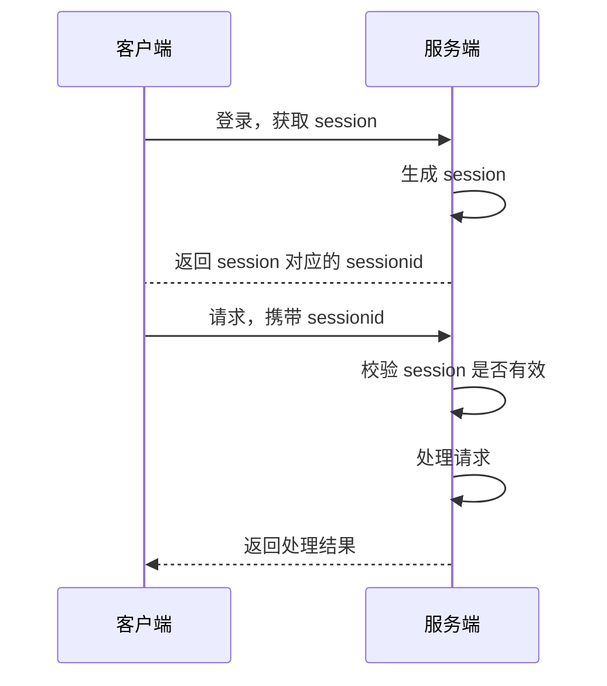

# 如何保持会话粘性，看看 Nginx 怎么做的

[toc]

你好，我是悟空。

## 背景

最近有个项目需求：

> 来自同一客户端的所有请求都被发送到同一个后端服务器，以确保会话数据或状态在服务器之间保持一致。

## 会话粘性

根据上面的需求，其实就是如何实现会话粘性。

会话粘性（Session Affinity）：也称为会话持久性（Session Persistence）或会话坚持（Session Stickiness），是一种**负载均衡**策略，其中来自同一客户端的所有请求都被路由到相同的后端服务器。这样做的目的是确保在多个服务器之间保持用户的会话数据或状态的一致性。通常，会话粘性通过客户端的标识信息来实现，最常见的标识信息是客户端的IP地址或Cookie。

客户端和服务端之间的交互如下图所示：





## 实现方案

Nginx 可以根据客户端的 IP 地址，将请求路由到不同的后端服务器。如下图所示：


三个客户端具有不同的固定 IP，客户端的请求达到 Nginx 之后，Nginx 对客户端 IP 进行哈希，算出一个哈希值，映射到某个上游服务器。

服务器端会生成和存储 session 的有效期，然后将 session 返给客户端，客户端下次发送请求时，携带 session。请求还是会发到上次的服务器上，服务器会校验客户端 session 是否存在以及是否在有效期内。

## ip_hash 指令

这里就需要用到 ip_hash 指令。

先来看下 ip_hash 如何用的。

``` sh
Syntax: ip_hash;
Default:
Context: upstream

```

来看下官网的解释：

> Specifies that a group should use a load balancing method where requests are distributed between servers based on client IP addresses. The first three octets of the client IPv4 address, or the entire IPv6 address, are used as a hashing key. The method ensures that requests from the same client will always be passed to the same server except when this server is unavailable. In the latter case client requests will be passed to another server. Most probably, it will always be the same server as well.

我们翻译过来的意思就是`ip_hash`用于指定组应使用负载平衡方法，其中请求根据客户端 IP 地址在服务器之间分配。客户端 IPv4 地址或整个 IPv6 地址的前三个八位字节用作散列密钥。该方法确保来自同一客户端的请求始终会传递到同一服务器，除非该服务器不可用。在后一种情况下，客户端请求将被传递到另一台服务器。最有可能的是，它也将始终是同一台服务器。

> 注意 1：从版本 1.3.2 和 1.2.2 开始支持 IPv6 地址。

如果需要暂时删除其中一台服务器，则应使用 `down` 参数对其进行标记，客户端请求才会被下一个服务器接收和处理。

> 注意2：在版本 1.3.1 和 1.2.2 之前， `ip_hash` 和权重配置不能一起使用。

## 使用示例

ip_hash 的配置示例如下：

```
upstream backend {
    ip_hash;

    server backend1.example.com;
    server backend2.example.com;
    server backend3.example.com down;
    server backend4.example.com;
}
```

以下是对这个配置的详细解释：

- `ip_hash`：这是一个Nginx指令，它告诉Nginx使用客户端的IP地址来决定将请求路由到哪个后端服务器。这意味着来自同一IP地址的所有请求都会被发送到同一个后端服务器。
- `server`：在 `upstream backend` 块内，列出了多个后端服务器。在这个示例中，有四个服务器：`backend1.example.com`、`backend2.example.com`、`backend3.example.com` 和 `backend4.example.com`。
  - `backend3.example.com down`：这里的 `down` 关键字表示将 `backend3.example.com` 标记为 "down"，即暂时禁用该服务器，不再接受新的连接。这可以用于临时将某个服务器从负载均衡中移除，以进行维护或修复。

通过这个配置，Nginx会根据客户端的IP地址将请求路由到相应的后端服务器，并确保来自同一客户端的所有请求都发送到同一个后端服务器，以保持会话数据或状态的一致性。

## 一个有趣的问题

我在 Github 上看到一个 ip_hash 有趣的问题：

https://gist.github.com/banjin/cf8d890591aa6c16d09e4ebfa6471284

> 你好。有个问题想请教一下。某个ip被hash分配到A机器后，假如机器A标记为down了，那这个ip是不是就会被分配到别的机器上了，比如机器B？如果机器A后面又好了的话，那这个ip是不是又从机器B分配回机器A了呢？相当于在A B之间来回处理了？假设客户端 IP 为 192.168.1.10

测试结果如下：

- A服务 -> down 之后, 192.168.1.10 发送过来的请求会分配给 B。
- A服务-> 去掉 down之后，192.168.1.10 发送过来的请求会重新分配 A 来处理。

## ip_hash 有哪些坑

1. **不适用于负载不均衡的情况**：`ip_hash`主要用于在多个后端服务器之间实现会话粘性，但它不会考虑服务器的负载。如果服务器之间的负载不均衡，某个服务器可能会处理更多的请求，而其他服务器则可能处于空闲状态。这可能导致资源利用不均衡。
2. **有限的负载均衡能力**：`ip_hash`并不是一个全功能的负载均衡解决方案。它仅仅依赖于客户端IP地址，而不考虑服务器的健康状态或性能。如果您需要更复杂的负载均衡策略，可能需要考虑其他Nginx模块，如`least_conn`或`ngx_http_upstream_module`，或者使用专门的负载均衡器。
3. **可能导致资源浪费**：如果某个客户端的IP地址在一段时间内请求频率非常高，它的所有请求都将路由到同一个后端服务器。这可能导致某些服务器负载较重，而其他服务器却处于轻负载状态，从而导致资源浪费。
4. **不适用于动态IP分配**：如果客户端使用动态IP地址，而且IP地址可能在短时间内变化（例如，通过DHCP），那么`ip_hash`可能不适用，因为客户端的IP地址可能在会话期间发生变化，导致会话状态丢失。
6. **维护会话状态**：使用`ip_hash`可能需要维护会话状态信息，这会增加一些系统复杂性。如果您需要跨多个服务器进行无状态负载均衡，这可能不是最佳选择。

## 总结

ip_hash 在解决会话粘性的场景中可以发挥出奇效，但是 ip_hash 也会存在一些问题，比如负载不均衡问题。


参考链接：http://nginx.org/en/docs/http/ngx_http_upstream_module.html#ip_hash