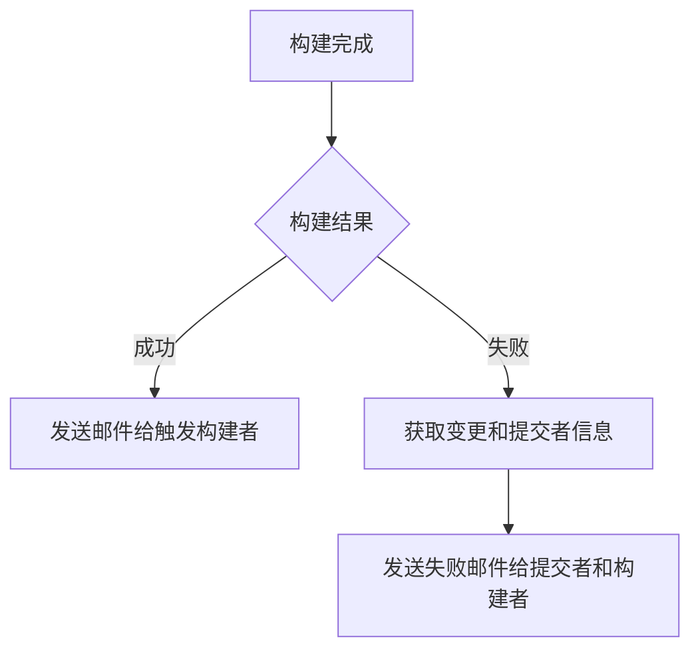
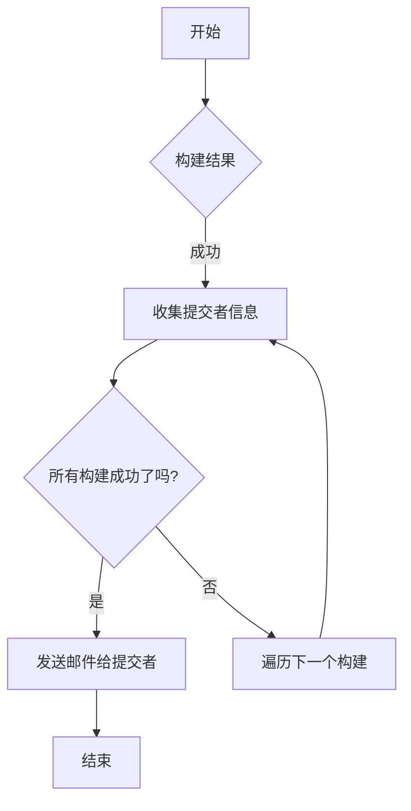

# 如何找到“BB”之人？（Break Build)

你好，我是悟空。

[toc]

## 一、前言

我们先来看一封 Break Build（BB） 邮件，如下图所示，这封邮件清楚的展示谁 BB 了，以及如何 BB 的。

今天我们要聊的话题是在自动化部署的过程中，如何找到造成本次部署失败的人。而在持续集成领域，部署失败被称作 **Break Build**，简称 **BB**。

>你是否遇到过自己提交了的代码，导致整个项目的代码**编译失败**？
>
>你是否因为编译失败而被**邮件通报**？
>
>你是否因为被邮件通报而被**罚money**？

这些都是我们之前项目组里面开发同学亲身经历。

他们因为将未经本地编译通过的代码直接往代码仓库提交，导致服务器编译打包部署时，直接报错，而耽误了整个测试进度。

然后这些开发同学就会收到一封 **“BB” 邮件**，凡是收到这封邮件的人，所在的小组会被记一笔小黑账，后续需上交一点点 money~

## 二、Break Build 是什么？

“Break build”是一个软件开发和持续集成（CI）领域的术语，通常指的是在构建软件的过程中遇到的失败或错误，导致整个构建过程无法完成。它提醒开发团队存在问题需要修复，确保只有稳定且无错误的代码才能进入后续阶段或部署到生产环境。。

以下是一些详细信息：

### 2.1 定义

构建过程包括从编译源代码、运行测试到打包成可部署的应用程序。当这个过程中的某一步失败时，我们称之为“break build”。

### 2.2 常见原因

- **代码错误**：如语法错误、编译错误或逻辑错误。
- **测试失败**：单元测试、集成测试或端到端测试未通过。
- **依赖问题**：缺少必要的库或版本冲突。
- **配置错误**：构建脚本或配置文件中的错误。
- **环境问题**：构建环境中的配置或资源问题，例如磁盘空间不足或网络问题。

### 2.3 影响
   - **开发效率**：开发人员需要花时间查找和修复错误，可能会延迟项目进度。
   - **团队协作**：其他开发人员可能无法在代码库的最新版本上继续工作，直到构建问题解决。
   - **质量保障**：未能通过构建的代码不能部署到生产环境，确保了只有通过所有测试的代码才会被发布。
### 2.4 处理方法
   - **快速反馈**：通过持续集成工具（如 Jenkins、GitLab CI、Travis CI 等）提供即时反馈，帮助开发人员迅速发现和解决问题。
   - **自动化测试**：在构建过程中自动运行各种测试，确保代码的正确性和稳定性。
   - **代码审查和静态分析**：在提交代码前进行代码审查和使用静态分析工具，减少引入错误的机会。
   - **分阶段构建**：将构建过程分成多个阶段（编译、测试、打包等），可以更快地定位和解决问题。

## 三、如何找到 Break Build 之人

### 3.1 通知逻辑

我们可以编写 Jenkins 的 Pipeline 脚本，如果此次打包失败了，则找出此次构建中的提交记录，并将代码提交者、提交注释、受影响的文件列表及提交时间都打印出来，并通过邮件形式发送给触发构建者以及提交代码的同学。如果打包成功了，则发送邮件给触发构建者。流程如下所示：

对应的 pipeline 脚本如下图所示：

### 3.2 找出代码提交者

**思路：**遍历当前构建及其之前的构建成功之间构建记录，然后收集每个构建中的提交者信息，最后发邮件给提交者。

流程如下图所示：

这里有个地方非常拗口：遍历当前构建及其之前的构建成功之间构建记录，怎么理解呢？

如下图所示，构建记录 #53 是成功的，那么本次要遍历的构建记录就是 #54~#58 这几条记录。

为什么不是直接找本次构建中的代码提交提交记录呢？原因是上一次构建后，下一次就拿不到提交记录了， 

对应的 pipeline 脚本如下图所示：

## 四、执行结果

执行构建后，可以看到本次构建中，有两次代码提交，有两个提交者，可能为同一个人。那么这两个提交者都会收到 Break Build 邮件，至于是谁最终造成的，得看部署日志了。

失败通知的邮件模板中打印提交记录的 html 如下所示：

另外在失败通知邮件中还会打印构建日志，如下图所示：

但还是无法确认是谁提交的代码造成的问题，这个时候可以看下构建日志。如下图所示，可以看到具体哪个地方报错了，然后找下谁改的这个文件以及代码行就能知道是谁造成编译失败了。

失败通知邮件模板中的打印构建日志的 html 如下所示：

## 五、总结

在自动化部署过程中，找到导致构建失败的提交者至关重要。

构建失败（Break Build，简称BB）通常由于代码错误、测试失败、依赖问题等原因引起，影响开发效率和团队协作。

我们可以通过编写 Jenkins Pipeline 脚本，在构建失败时遍历当前构建及其之前的构建记录，收集每个构建中的提交者信息，并将这些信息通过邮件发送给相关人员。这不仅能迅速通知提交者修复问题，还能确保代码的稳定性和质量。

通过持续集成工具的快速反馈和自动化测试，我们能够有效地预防和处理 Break Build，提高整体开发效率。

完整脚本请到知识星球获取。

