在日常工作中，难免会画一些流程图、时序图。之前都是选择使用在线的画图网站，画完然后截图插入到文档。我个人用的比较多的主要是 `腾讯文档` 。

相较于截图的方式，代码画图都有哪些好处呢？

- 使用比较轻便。 不需要额外安装类似 `draw.io` 之类的画图软件，很多 markdown 编辑器都自带了这个功能。
- 使用便捷简单。 如果截图的方式，需要考虑图片大小以及对齐问题。流程变动了需要先去在线平台重新绘制，然后重新截图，相对比较麻烦。而代码画图不需要考虑这些。只要按照语法即可快速画图。

下边就来看一下，通过 markdown 语法是如何进行画图的。

## markdown 语法

当我需要画图时插入如下这样的一个代码块：

~~~go
go

复制代码```mermaid
    流程图/时序图代码
```
~~~

## 流程图

### 流程图布局

流程图代码以「graph 《布局方向》」开头，布局方向主要有如下几种：

- TB，从上到下
- TD，从上到下
- BT，从下到上
- RL，从右到左
- LR，从左到右

例：

````
```mermaid
graph TB
```
````

### 流程常用符号

```css
A（起止框）
```

用法如下：

```css
B[处理框]
```

可以使用 HTML 中的实体字符。

```
A["双引号：#quot;"]
```

```
C{判断框}
```

```
D(（连接）)
```

### 流程图连接样式

- 实线，箭头，文字


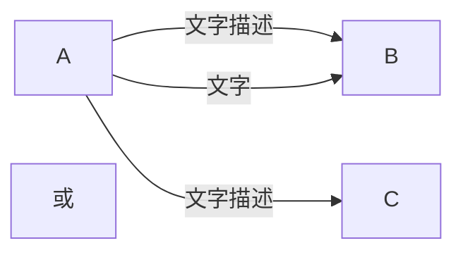

- 实线，箭头，无文字


- 实线，无箭头，无文字

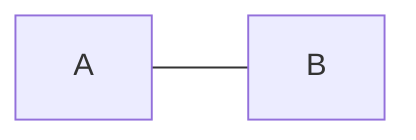

- 实线，无箭头，文字

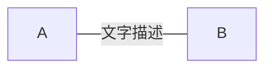

- 虚线，箭头，无文字

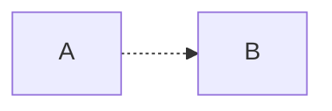

- 虚线，箭头，文字

```css
graph LR;
A-. 文字 .->B;
```

综合示例：

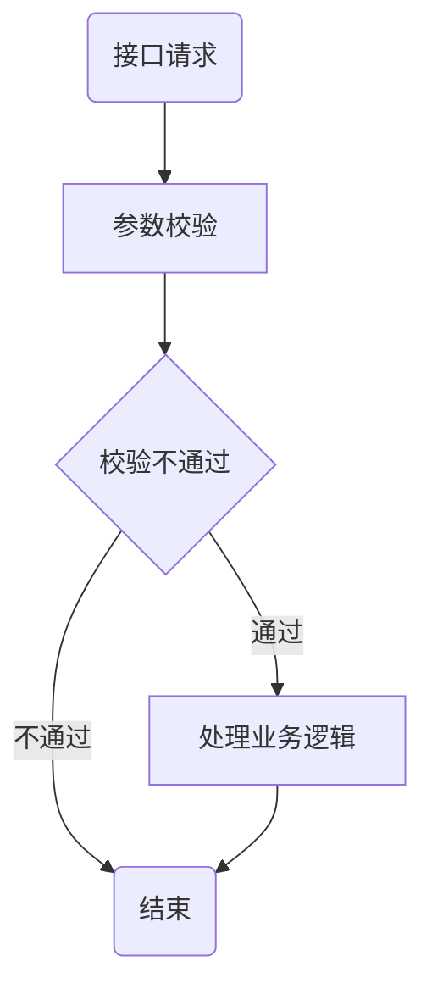

## 时序图

时序图代码以「sequenceDiagram」开头。 时序图中包括如下常见元素：

### 参与者

```csharp
participant [别名 as ]《参与者名称》。
```

语句次序即为参与者横向排列次序。

### 消息

交互时一方对另一方的操作（比如接口调用）或传递出的信息。

- 用单向箭头来表示——实线代表主动发出消息；
- 虚线代表响应；
- 末尾带「X」代表异步消息，无需等待回应。

消息语句格式为：

```markdown
<参与者> <箭头> <参与者> : <描述文本>。
```

其中 <箭头> 的写法有：

```markdown
->> 显示为实线箭头（主动发出消息）
-->> 显示为虚线箭头（响应）
-x 显示为末尾带「X」的实线箭头（异步消息）
```

示例：

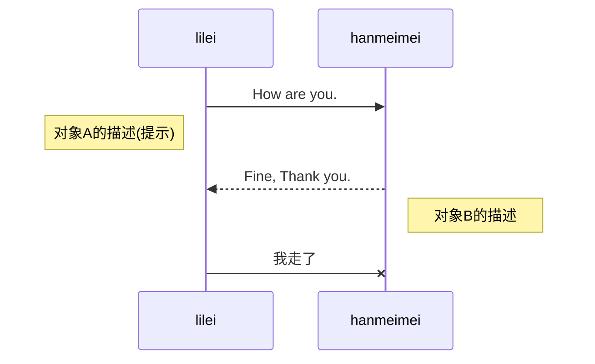

lileihanmeimei对象A的描述(提示)对象B的描述How are you.Fine, Thank you.我走了lileihanmeimei

### 激活框

从消息接收方的时间线上标记一小段时间，表示对消息进行处理的时间间隔。

```markdown
<参与者> <箭头> [+/-]: <描述文本>。
```

示例：

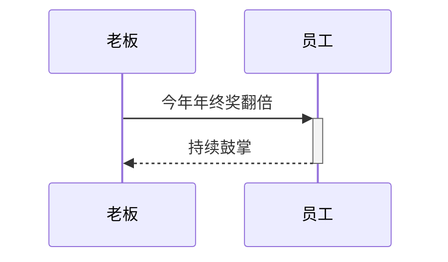

老板员工今年年终奖翻倍持续鼓掌老板员工

### 注解

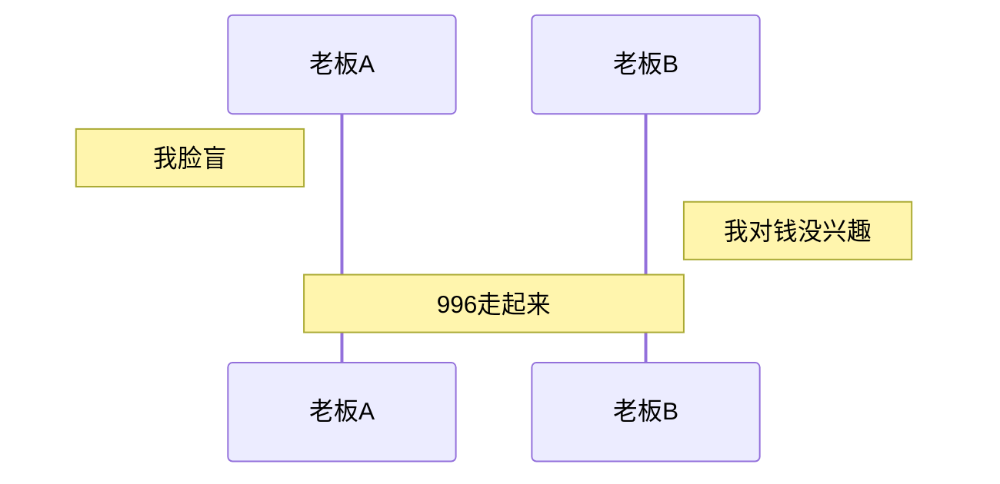

老板A老板B我脸盲我对钱没兴趣996走起来老板A老板B

### 循环

相当于编程代码中的 while 循环 循环格式为：

```markdown
loop 循环的描述
    消息
end
```

示例：

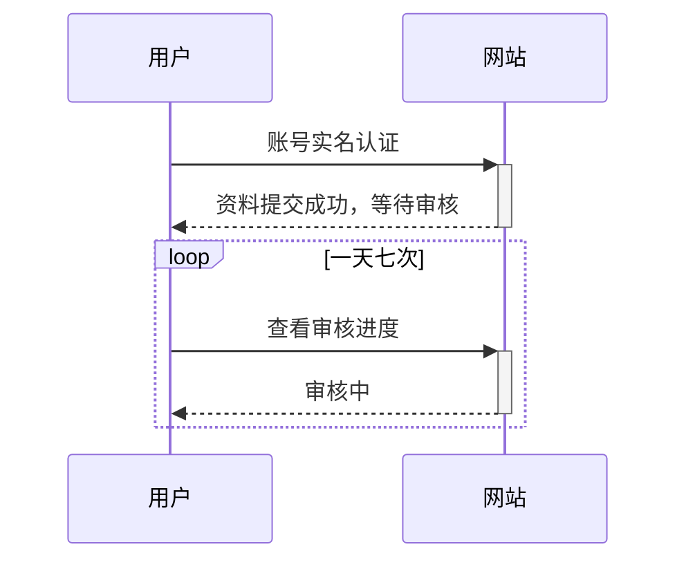

用户网站loop[一天七次]账号实名认证资料提交成功，等待审核查看审核进度审核中用户网站

### 选择(alt)

相当于 if 及 else if 语句。或者理解为 switch 也可以

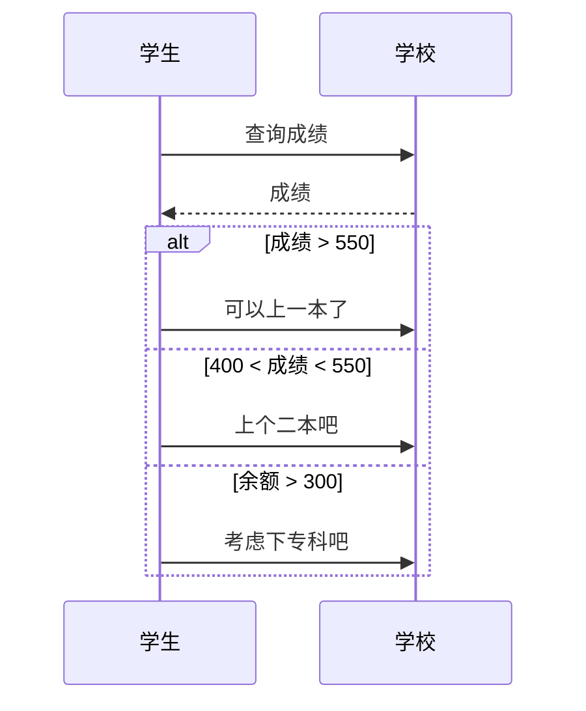

学生学校alt[成绩 > 550][400 < 成绩 < 550][余额 > 300]查询成绩成绩可以上一本了上个二本吧考虑下专科吧学生学校

### 可选

相当于单个分支的 if 语句。

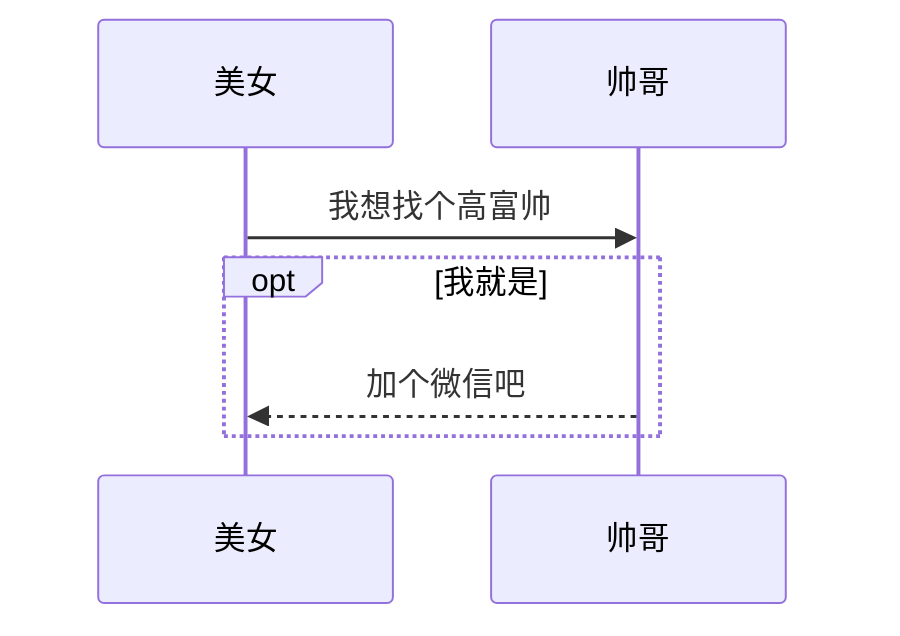

美女帅哥opt[我就是]我想找个高富帅加个微信吧美女帅哥

### 并行

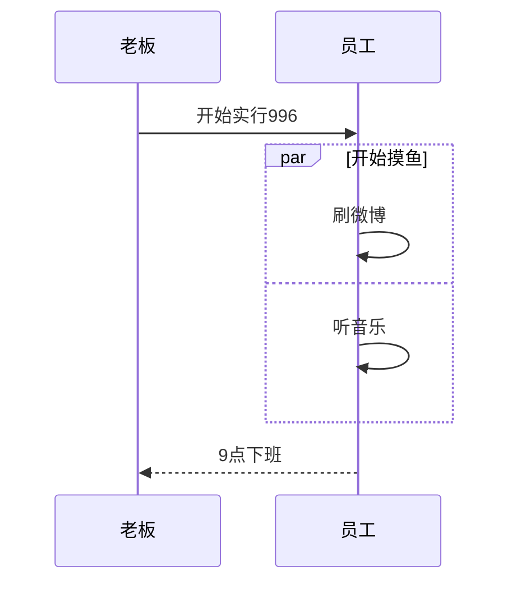